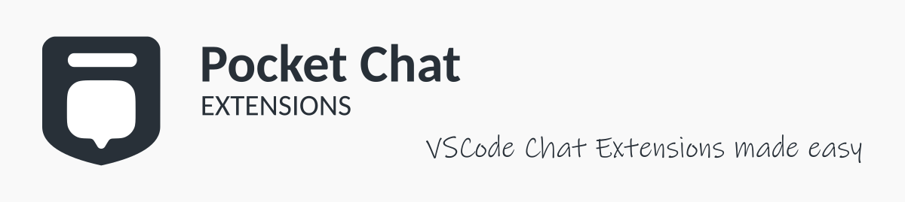
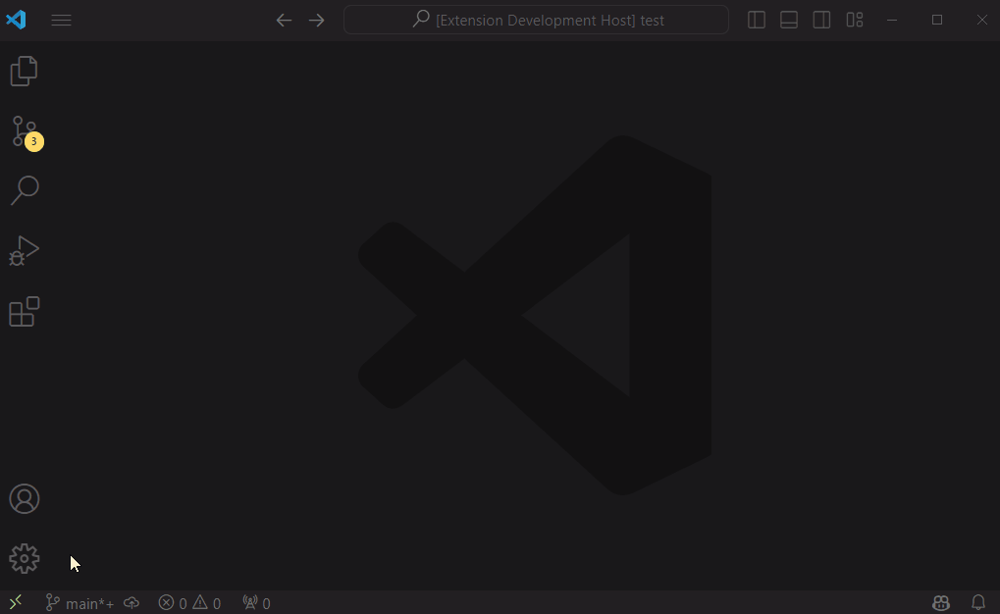

# Pocket Chat Extensions



## Overview

Pocket Chat Extensions is a Visual Studio Code extension that provides a set of tools to help developers to create their own chat extensions easily.

Without this extension, developers would have to create their own extension from scratch, which would be a time-consuming process. This extension allows developers to create their own chat extensions with ease.



Adding a new participant to a workspace is as simple as giving the participant a name and you're ready to start coding the behaviour of the participant, with complete access to VSCode's API and additional utilities.

> **Warning**
> The extension is currently in early stages of development. Expect breaking changes and unfinished features. Contributions are more than welcome!

### Key Features

- VSCode command to guide you through the creation process
- Create chat participants with ease
- Define slash commands for your chat participants
- Access to the VSCode API directly
- Utility functions to help you with common tasks

## User Guide

### Requirements
- Visual Studio Code 1.90 or later
- Github Copilot Chat or a similar extension that uses the VSCode Chat API

### Installation

The extension is not yet available on the marketplace. To install the extension, you will need to either download the `.vsix` file from the releases page or build the extension from the source code yourself.

#### Downloading from the releases page

1. Go to the [latest release page](https://github.com/vrattic/pocket-chat-extensions/releases/latest) and download the `.vsix` file
2. Open Visual Studio Code
3. Press `Ctrl+Shift+P` to open the command palette
4. Type `Extensions: Install from VSIX...` and press `Enter`
5. Select the `.vsix` file you downloaded and reload VSCode

#### Building from source

1. Follow the instructions in [Getting Started](#getting-started) to get the repo ready
2. Check out to the `release` branch to build from the latest stable version
3. Run `npx vsce package` to build the extension. This will create a `.vsix` file in the root directory
4. Open Visual Studio Code and install the extension as described above

### First Steps

Once you have the extension installed, you are ready to start creating your own chat participants. To create your first chat participant, follow these steps:

1. Open the workspace where you want to add the chat participant
2. Press `Ctrl+Shift+P` to open the command palette
3. Type `Pocket Chat Extensions: Create New Participant` and press `Enter`
4. Follow the instructions. You will need to provide a name and an adapter for the participant

This will create a new configuration file in your workspace with the new participant. Now you can start coding the behaviour of the participant.

Before you can start using the participant, you will need to reload the window. Once you have reloaded the window, you can start using the participant by opening the chat panel and typing `@<participant-name>`.

Later on, if you want to add another participant, you can use the same command to append a new participant to the existing configuration file.

### The configuration file

The extension uses a configuration file to store the participants and their settings. The configuration file is created by default at `.vscode/pocket-chat.js` in your workspace. You can edit this file directly to add new participants or change the settings of existing participants.

The extension supports having multiple configuration files in the same or across different workspaces. Valid paths for the configuration file are:

- `.vscode/pocket-chat.js`
- `.vscode/pocket-chat.foo.js`
- `.vscode/pocket-chat.bar.js`

#### Expected structure

The configuration file should contain a top-level array with the participants as objects. Each participant object should have the following properties:

- `name` (string): The name of the participant.
- `fullName` (string): The full name of the participant.
- `description` (optional string): A description of the participant.
- `handler` (Function): The function that handles the participant's behavior.
- `adapter` (string): The adapter to use for the handler function.
- `isSticky` (optional boolean): Indicates if the participant should remain active in the following messages.
- `commands` (optional array): An array of objects representing the slash commands available for the participant. Each object should have a `name` (string) and a `description` (string).

Here's an example of how a participant object would look like:

```javascript
{
  name: "participantname",
  fullName: "Participant Name",
  description: "This is a participant description",
  adapter: "default",
  handler: (/* Params change depending on the adapter used */) => { 
    /* Participant behavior */ 
  },
  isSticky: true,
  commands: [
    { name: "command1", description: "Command 1 description" },
    { name: "command2", description: "Command 2 description" }
  ]
}
```

### Adapters and handlers signature

The adapter is a string that tells the extension which adapter to use for the participant handler. Different adapters send different parameters to the handler function. The following adapters are available:

- `default`: The default adapter. Keeps the same signature as VSCode Chat API's `vscode.ChatRequestHandler`.
- `extended`: Almost the same as the default adapter, but with an additional parameter with utility functions.

In either case the handler function can use the VSCode API via the `vscode` object.

#### Default adapter

The default adapter requires the handler function to have the following signature:

```javascript
/**
 * @param {vscode.ChatRequest} request
 * @param {vscode.ChatContext} context
 * @param {vscode.ChatResponseStream} stream
 * @param {vscode.CancellationToken} token
 * @returns {Promise<void>}
 */
```

This is the same signature as the `vscode.ChatRequestHandler`. You can read about it [here](https://code.visualstudio.com/api/extension-guides/chat).

#### Extended adapter

The extended adapter requires the handler function to have the following signature:

```javascript
/**
 * @param {vscode.ChatRequest} request
 * @param {vscode.ChatContext} context
 * @param {vscode.ChatResponseStream} stream
 * @param {vscode.CancellationToken} token
 * @param {*} utils
 * @returns {Promise<void>}
 */
```

This is the same as the default adapter, but with an additional parameter `utils` that contains utility functions to help you with common tasks. The `utils` object provides the following functions:

- `utils.lm.generate(prompt: string, family: string = 'fast'): Promise<string>`
  - **Description**: Generates a response from a language model based on the provided prompt. The `family` parameter can be 'fast' (defaulting to 'gpt-3.5-turbo'), 'best' (defaulting to 'gpt-4') or the name of a specific model.

- `utils.res.append(message: any): void`
  - **Description**: Appends a message to the stream in markdown format.

- `utils.res.appendLn(message: any): void`
  - **Description**: Appends a message to the stream in markdown format followed by a newline.


### Participants and commands usage

Once you have created a participant, you can start using it in the chat panel (eg. `GitHub Copilot Chat`). To use a participant, you need to type `@` followed by the participant name. If your participant doesn't appear in the suggestions, you may need to reload the window.

After you have selected the participant, you can start typing your prompt. If you have defined any slash commands for the participant, you can use them by typing `/` followed by the command name.

Then, you can press `Enter` to send the message to the participant. This will trigger the handler function of the participant. The prompt can be accessed via the `request.prompt` property and the command applied via the `request.command` property (`undefined` if no command was used).


### Examples

Here are some examples of different participants to help you get started:

#### Echo participant

This participant echoes the prompt back to the user and any command used.

```javascript
{
  name: "echo",
  fullName: "Echo Participant",
  description: "Echoes the prompt back to the user",
  adapter: "default",
  handler: async (request, context, stream, token) => {
    stream.markdown(`You said: ${request.prompt}`);
    if (request.command) {
      stream.markdown(`\n\nWith the command: ${request.command}`);
    }
  },
  commands: [
    { name: "test", description: "Test command" }
  ]
}
```

Usage:

```
> @echo Hello, world!
You said: Hello, world!

> @echo /test Bye, world!
You said: Bye, world!
With the command: test
```

#### Commit writer participant

This participant helps you write a commit message by generating a prompt based on the provided message.

```javascript
{
  name: "commit-msg",
  fullName: "Commit Message Writer",
  description: "Tell me your changes and I will write a commit message for you",
  adapter: "extended",
  handler: async (request, context, stream, token, utils) => {
    const prompt = `Write a concise commit message for the following changes:\n${request.prompt}`;
    const message = await utils.lm.generate(prompt);
    stream.markdown(`Commit message: ${message}`);
  }
}
```

Usage:

```
> @commit-msg I changed the primary button color to blue and doubled the font size
Commit message: Change primary button style
```


## For Contributors

The extension is based on the official template [Yo Code](https://code.visualstudio.com/api/get-started/your-first-extension), using TypeScript and Webpack.

### Pre-requisites

- npm
- Visual Studio Code 1.90 or later
- Github Copilot Chat or a similar extension that uses the VSCode Chat API

### Getting Started

1. Clone the repository `git clone <repo-url>`
2. Move into the cloned directory `cd <repo-name>`
3. Install dependencies `npm install`
4. Open the project in Visual Studio Code `code .`
5. Install the [recommended extensions](.vscode/extensions.json) for the best experience

### Running the extension

To run the extension, press `F5` in Visual Studio Code. This will open a new window with the extension loaded.

For most things you will need to have a workspace open, you may want to create a new workspace for testing the extension.

#### Making changes

* You can relaunch the extension from the debug toolbar after changing code in `src/extension.ts`.
* You can also reload (`Ctrl+R` or `Cmd+R` on Mac) the VS Code window with your extension to load your changes.
* Set breakpoints in your code inside `src/extension.ts` to debug your extension.
* Find output from your extension in the debug console.

### Running tests

* Install the [Extension Test Runner](https://marketplace.visualstudio.com/items?itemName=ms-vscode.extension-test-runner)
* Run the "watch" task via the **Tasks: Run Task** command. Make sure this is running, or tests might not be discovered.
* Open the Testing view from the activity bar and click the Run Test" button, or use the hotkey `Ctrl/Cmd + ; A`
* See the output of the test result in the Test Results view.
* Make changes to `src/test/extension.test.ts` or create new test files inside the `test` folder.
  * The provided test runner will only consider files matching the name pattern `**.test.ts`.
  * You can create folders inside the `test` folder to structure your tests any way you want.


### Contributing

Contributions are more than welcome! If you have an idea for a new feature or a bug fix, please open an issue first to discuss it.

Base your changes on the latest `main` branch commit. Please make sure the pull request is properly documented and tested, with no linting errors. And that's about it!

#### Branches

- `main`: This branch contains the latest development changes. It should be used as the base for new features and bug fixes.
- `release`: This branch contains the latest stable version of the extension. VSIX releases are built from this branch.

### Vision

The only goal of this extension is to simplify the process of creating powerful chat extensions for individual users and teams. It aims to provide users with a high level of flexibility while keeping the development and usage of the extension as simple as possible.

### Roadmap

- [x] Create custom chat participant
- [x] Define slash commands
- [x] Command to guide users through the creation process
- [ ] Provide a more complete suite of utility functions
- [ ] Improve error handling
- [ ] Create adapter for participants that only need to add context
- [ ] Deploy mkdocs on gh pages for user documentation
- [ ] Refactor the codebase for better maintainability
- [ ] Add tests to the existing codebase
- [ ] Built-in participant to assist and help users with the extension

### License

This project is licensed under the MIT License - see the [LICENSE](LICENSE) file for details.

